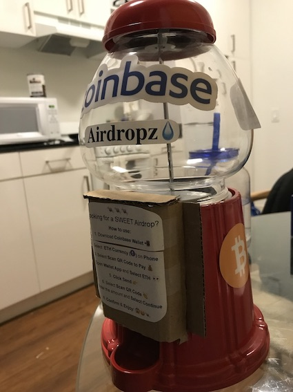

# Airdropz Candy

Airdropz is an automated candy dispenser which uses cryptocurrency for payments via Coinbase Commerce.

The system is composed of a coninuously polling Flask server on the
Raspberry Pi which queries Coinbase Commerce for new payment events to
determine when to dispense candy. It also uses a simple "Point of Sale"
website hosted on [www.airdropz.xyz](www.airdropz.xyz) which is used to
intiate checkout. 

When the flask app receives a new payment event it triggers a servo expected to be mounted to the candy machine to dispense candy. 

## How to Build

Total cost is ~$150 but you can probably go cheaper with a more inexpensive Raspberry Pi.

1. Candy Machine - [Amazon](https://www.amazon.com/Carousel-JUNIOR-Medium-Gumball-Bank/dp/B00S0TS1KY/ref=sr_1_2?dchild=1&keywords=candy+machine&qid=1597244568&sr=8-2) - ~$30
2. Servo Motor - [Amazon](https://www.amazon.com/dp/B01MSAIL3D/ref=dp_cerb_1) - ~ $17
3. Raspberry Pi - [Amazon](https://www.amazon.com/gp/product/B07BCC8PK7/ref=ppx_yo_dt_b_asin_title_o00_s00?ie=UTF8&psc=1) - ~$80 (for the whole kit)

### Mounting Servo

Take apart the Candy machine, and locate the [adjustable dispensing wheel](https://www.candymachines.com/images/helper/carousel-gumball-machines/carousel-gumball-machine-parts.jpg). You will need to insert the servo such that the blade sits within one of the notches of the wheel. When triggered, the servo rotates and spins the wheel causing the candy to be dispensed.

## Repos
[RPi Flask Server](./flask-app): Flask server on Raspberry Pi
that polls CBCommerce API and dispenses candy.

[Point of Sale Portal](./point-of-sale): HTML page that links
to Coinbase Commerce checkout screen. 

## Licence 

MIT 

